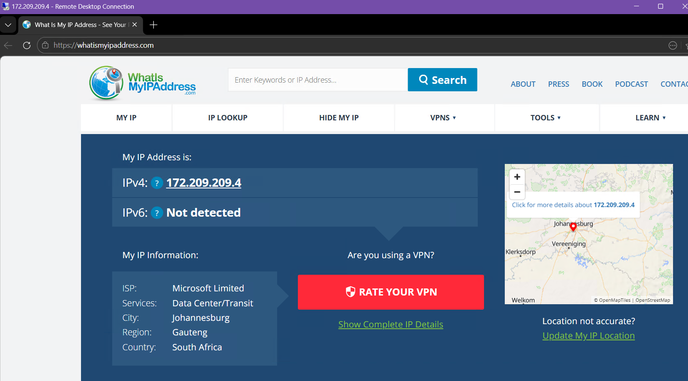
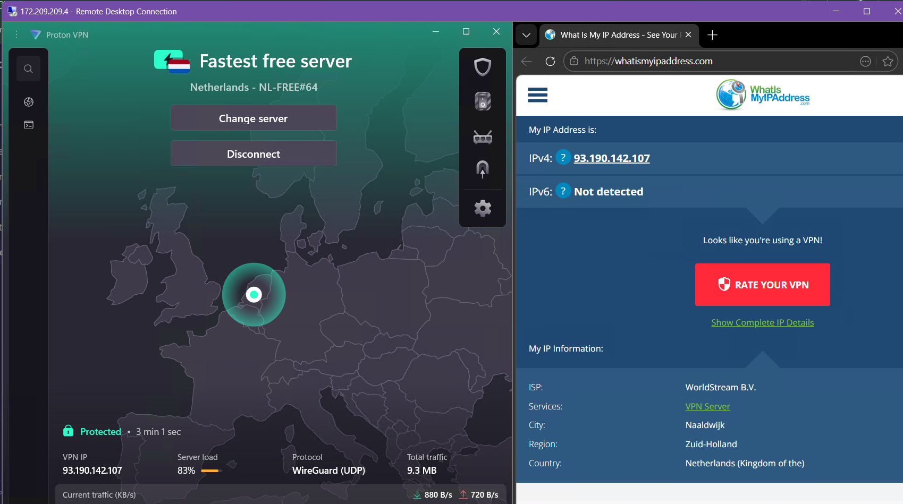
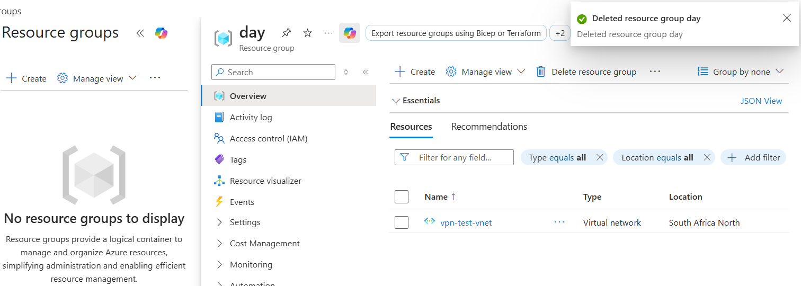

# azure-vpn-traffic-tunneling

## Introduction
This lab environment was established to demonstrate the deployment of cloud-based infrastructure and the implementation of multi-layered networking tunnels. By provisioning a Virtual Machine (VM) in a distinct geographic region and subsequently layering a Virtual Private Network (VPN) within that environment, this project explores how public IP addresses are assigned, masked, and routed across global infrastructures. The objective is to validate the integrity of encrypted tunnels and observe regional DNS redirection in a controlled cloud environment.

## Technical Skills & Tools
* Cloud Infrastructure: Microsoft Azure (Resource Groups, Virtual Machines, Network Security Groups).
* Networking Protocol: Remote Desktop Protocol (RDP) for secure administrative access.
* Traffic Management: VPN Tunneling via ProtonVPN.
* Geolocation Analysis: Public IP auditing and regional content validation.
* Cost Management: Resource lifecycle management and decommissioning.

---
## Part 1: Cloud Resource Provisioning
The foundation of the lab involved establishing an isolated environment in Microsoft Azure. A dedicated Resource Group was created to act as a logical container for all networking assets. Within this container, a Windows 11 Pro instance was deployed in a South Africa data center to establish a distinct geographic baseline. 
* Secure Perimeter: Configured Network Security Groups (NSGs) to whitelist RDP traffic exclusively from the local host IP.
* Connectivity Audit: Verified the baseline public IP and routing origin via the African data center through an RDP session.

  

---

## Part 2: VPN Tunneling & Security
ProtonVPN was implemented within the virtualized environment to establish a secondary encrypted tunnel. This configuration allows for "tunnel-within-a-tunnel" routing, effectively masking the VM's cloud-provider origin.
* Traffic Encapsulation: Successfully routed outbound traffic from the Azure backbone through a third-party VPN exit node.
* Geolocation Masking: Transitioned the public identity of the VM from South Africa to a third country (e.g. Netherland) to test regional delivery.
* Administrative Stability: Managed the VPN routing table to ensure the active RDP connection was maintained without a "blackout" or session drop.
* Evidence of Masking: Verified the success of the tunnel by monitoring real-time IP changes via external auditing sites.

  

---

## Part 3: Analysis & Decommissioning
The final phase involved testing the impact of masked geolocation on web delivery and performing a full audit of the resource lifecycle.
* Regional Content Analysis: Validated that web services (Google, YouTube) automatically redirected to Dutch (.nl) domains and adjusted interface languages based on the new exit node.
* Resource Lifecycle Management: Executed a full deletion of the Resource Group to purge the VM and all networking assets, ensuring zero residual costs.

  

---

## Project Outcome & Key Takeaways
The lab successfully validated the implementation of multi-layered network security within a cloud environment. By establishing a stable RDP connection across continents and layering an encrypted tunnel, the project demonstrated that geolocation masking and traffic encapsulation can be achieved without compromising administrative access or system stability.

### Core Technical Competencies
* **Cloud Infrastructure (IaaS):** Provisioning and managing virtualized compute and networking assets within Microsoft Azure.
* **Network Security:** Configuring Network Security Groups (NSGs) for IP whitelisting and secure Remote Desktop (RDP) access.
* **Traffic Encapsulation:** Implementing VPN tunneling to mask data center origins and override default cloud gateways.
* **Resource Management:** Managing the full lifecycle of cloud resources, from deployment to cost-efficient decommissioning

### Key Takeaways
* **Global Deployment:** Gained hands-on experience navigating Azure’s global regions to manage latency and regional routing.
* **Encrypted Tunnels:** Successfully executed a "tunnel-within-a-tunnel" scenario, maintaining an active RDP session while shifting public IPs.
* **Geolocation Testing:** Observed the real-time impact of DNS redirection and localized web delivery through a Netherlands-based exit node.
  

